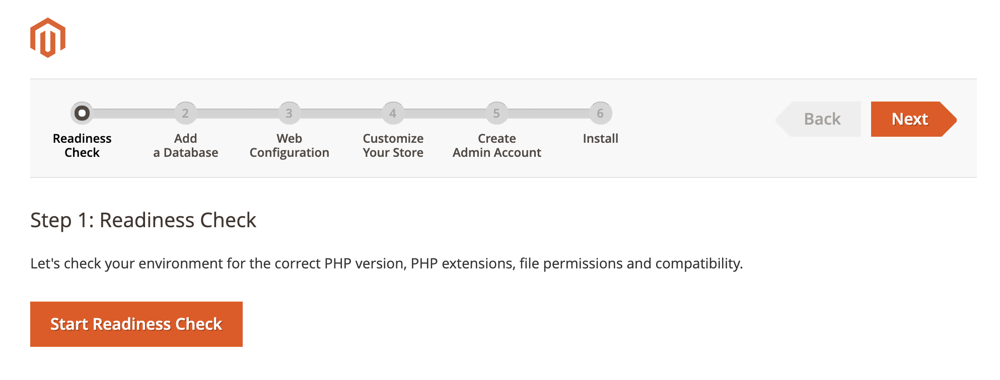
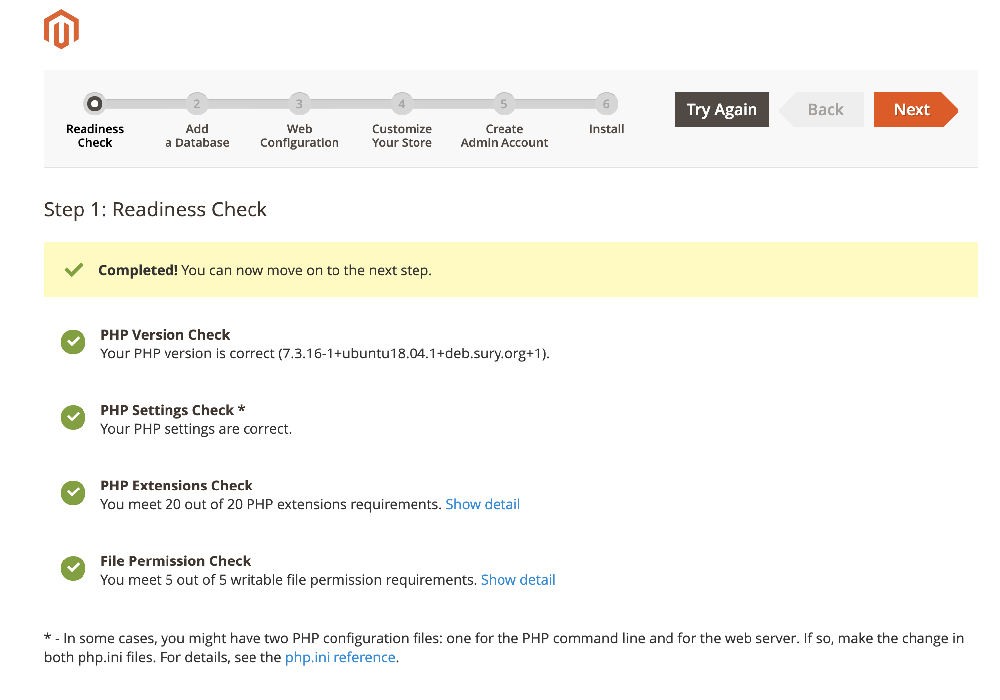
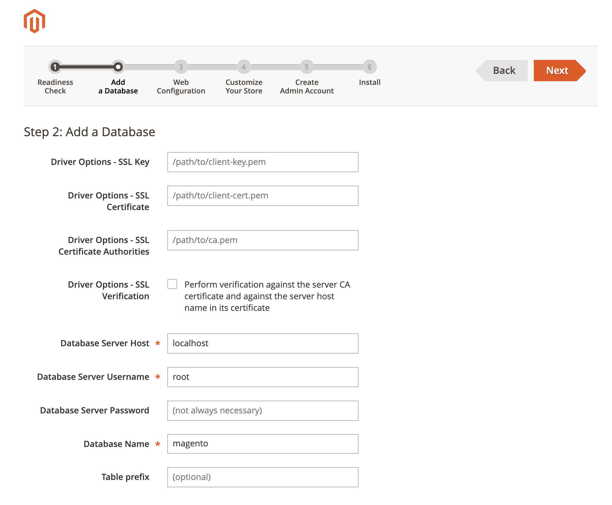
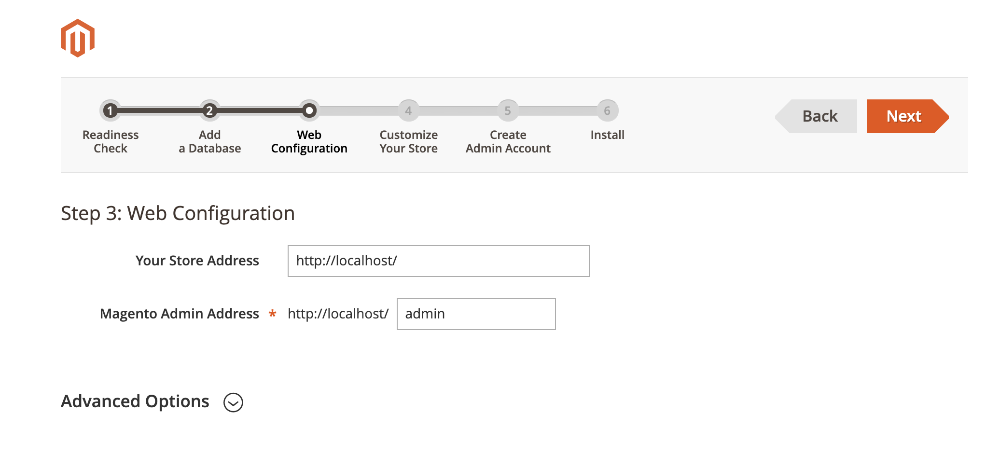
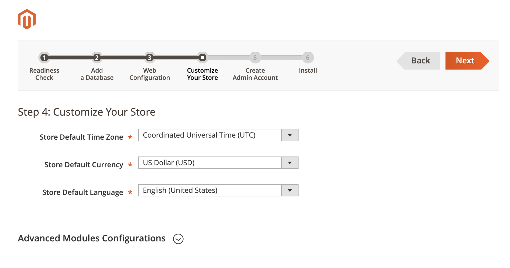
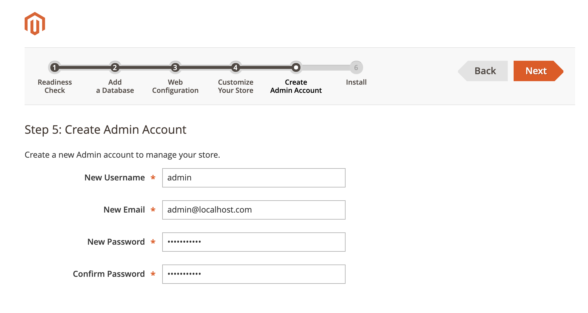
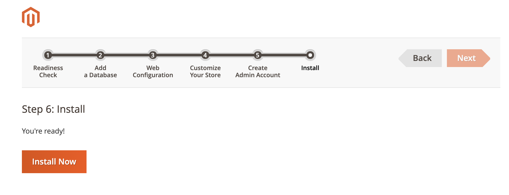
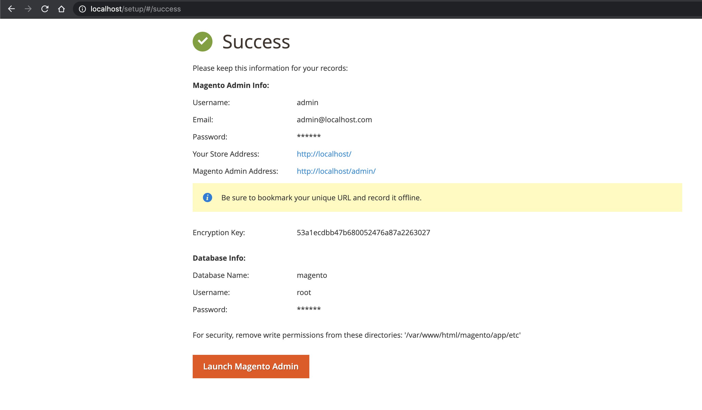
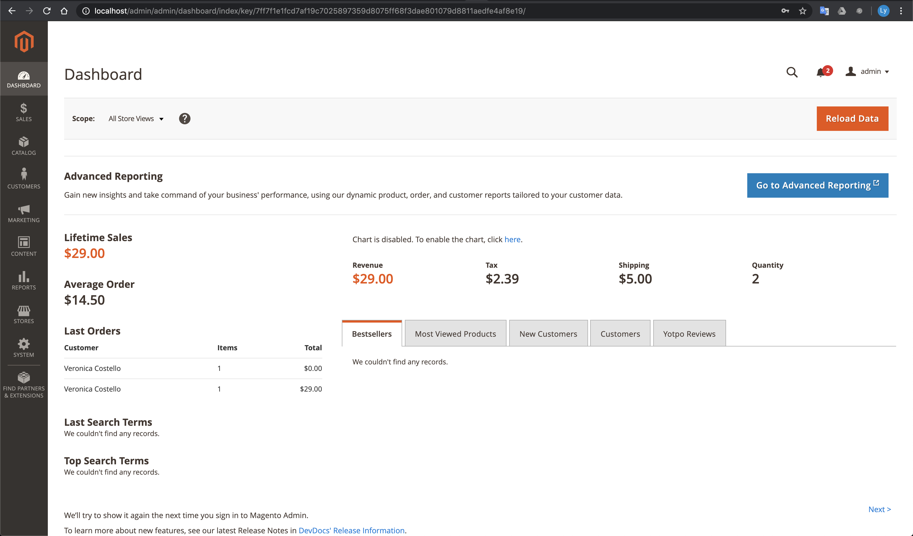
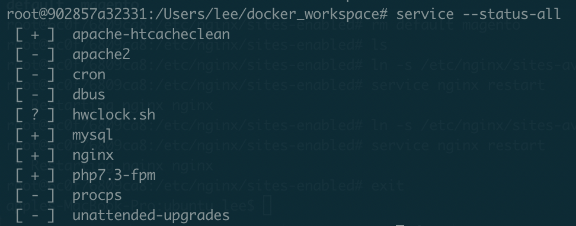

# magento2-nginx-ubuntu-setup
## Create docker ubuntu 18.04 container
### In host side:
```sh
$ mkdir ~/docker_workspace
$ cd ~/docker_workspace
```
```sh
docker run -p 80:80 -p 3306:3306 -p 8000:8000 --cpuset-cpus="0-3" --name ubuntu-magento -w $PWD -it -v
```
- port 80: magento site
- port 3306: mysql server
- port 8000: phpmyadmin

## Install php & php-fpm
### In docker container (ubuntu-magento) side:
```sh
$ apt-get update
$ apt-get -y install nano software-properties-common
$ add-apt-repository ppa:ondrej/php
$ apt-get update
$ apt install -y php7.3 libapache2-mod-php7.3 php7.3-common php7.3-gmp php7.3-curl php7.3-soap php7.3-bcmath php7.3-intl php7.3-mbstring php7.3-xmlrpc php7.3-mysql php7.3-gd php7.3-xml php7.3-cli php7.3-zip
$ apt-get -y install php7.3-fpm
$ nano /etc/php/7.3/fpm/php.ini
```
```sh
press ctrl + w for searching
memory_limit = 2G
max_execution_time = 3600
max_input_time = 1800
upload_max_filesize = 128M
zlib.output_compression = On
press ctrl + O for saving.
```
```sh
$ service php7.3-fpm start
```
## Install mysql
```sh
$ apt-get install -y mysql-server
$ service mysql start
$ mysql_secure_installation
```
```sh
VALIDATE PASSWORD PLUGIN
Press y|Y for Yes, any other key for No: y
Please enter 0 = LOW, 1 = MEDIUM and 2 = STRONG: 1
Do you wish to continue with the password provided?(Press y|Y for Yes, any other key for No) : y
Remove anonymous users? (Press y|Y for Yes, any other key for No) : y
Disallow root login remotely? (Press y|Y for Yes, any other key for No) : y
Remove test database and access to it? (Press y|Y for Yes, any other key for No) : y
Reload privilege tables now? (Press y|Y for Yes, any other key for No) : y
```
## Remove mysql root password
```sh
$ mysql -u root -p
(pass: root)
```
```sh
mysql> DROP USER 'root'@'localhost';
mysql> uninstall plugin validate_password;
mysql> CREATE USER 'root'@'%' IDENTIFIED BY '';
mysql> GRANT ALL PRIVILEGES ON *.* TO 'root'@'%' WITH GRANT OPTION;
mysql> FLUSH PRIVILEGES;
mysql> exit;
```
Now try to connect again:
```sh
mysql -u root
```
==> If don't require pass, It's OK

## Install Nginx
```sh
$ apt-get -y install nginx
$ rm /etc/nginx/sites-enabled/default
```
## Copy magento with sample to docker container
https://magento.com/tech-resources/download
### In host side:
Copy Magento-CE-2.3.4_sample_data-2020-01-22-11-11-58.tar.gz to ~/docker_workspace
### In docker container side:
```sh
$ mkdir /var/www/html/magento
$ tar -zxvf Magento-CE-2.3.4_sample_data-2020-01-22-11-11-58.tar.gz -C /var/www/html/magento
$ chown -R www-data:www-data /var/www/html/magento
$ chmod -R 755 /var/www/html/magento
```
## Create magento site
```sh
$ nano /etc/nginx/sites-available/magento
```
Copy magento.conf and paste to this file
```sh
$ ln -s /etc/nginx/sites-available/magento /etc/nginx/sites-enabled/
$ nginx -t
$ service nginx restart
```
## Create a Magento database:
```sh
$ mysql -u root -p
```
```sh
mysql> create database magento;
mysql> exit;
```
## Setup magento on browser
Open browser: http://localhost












## Install phpMyAdmin
```sh
$ apt install phpmyadmin
```
```sh
Configure database for phpmyadmin with dbconfig-common? [yes/no] yes
(Enter the items you want to select, separated by spaces.)
(space and enter)
```
*** During the installation, it will prompt you to select a web server to configure. Nginx isn’t in the list, so press the Tab key and hit OK to skip this step.
```sh
$ mysql -u root
```
```sh
mysql> show grants for phpmyadmin@localhost;
+--------------------------------------------------------------------+
| Grants for phpmyadmin@localhost                                    |
+--------------------------------------------------------------------+
| GRANT USAGE ON *.* TO 'phpmyadmin'@'localhost'                     |
| GRANT ALL PRIVILEGES ON `phpmyadmin`.* TO 'phpmyadmin'@'localhost' |
+--------------------------------------------------------------------+
2 rows in set (0.00 sec)

mysql> exit;
Bye
```
```sh
$ nano /etc/nginx/sites-available/phpmyadmin
```
Copy phpmyadmin.conf and paste to this file
```sh
$ ln -s /etc/nginx/sites-available/phpmyadmin /etc/nginx/sites-enabled/
$ nginx -t
$ service nginx restart
```
### *Login without a password is forbidden by configuration (see AllowNoPassword)*
```sh
$ nano /etc/phpmyadmin/config.inc.php
```
Find the line:
```sh
// $cfg['Servers'][$i]['AllowNoPassword'] = TRUE;
```
Uncomment that line; you’ll remove the //.

## Backup & restore docker container:
### Backup
```sh
$ docker commit -p ubuntu-magento magento2-nginx-ubuntu
```
```sh
$ docker images
```
```sh
REPOSITORY                    TAG                 IMAGE ID            CREATED             SIZE
magento2-nginx-ubuntu         latest              f6a3f0e82628        9 seconds ago       1.76GB
```
```sh
$ docker save -o magento2-nginx-ubuntu.tar magento2-nginx-ubuntu
```
### Restore
```sh
$ docker load -i magento2-nginx-ubuntu.tar
$ docker images
```
```sh
REPOSITORY                    TAG                 IMAGE ID            CREATED             SIZE
magento2-nginx-ubuntu         latest              f6a3f0e82628        9 seconds ago       1.76GB
```

## Notes:
```sh
$ service --status-all
```


```sh
$ service php7.3-fpm restart
$ service nginx restart
$ service mysql restart
```
### Run at startup
```sh
$ nano ~/.bashrc
```
Add below content to this file
```sh
service php7.3-fpm restart
service nginx restart
service mysql restart
```